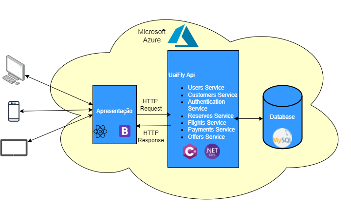
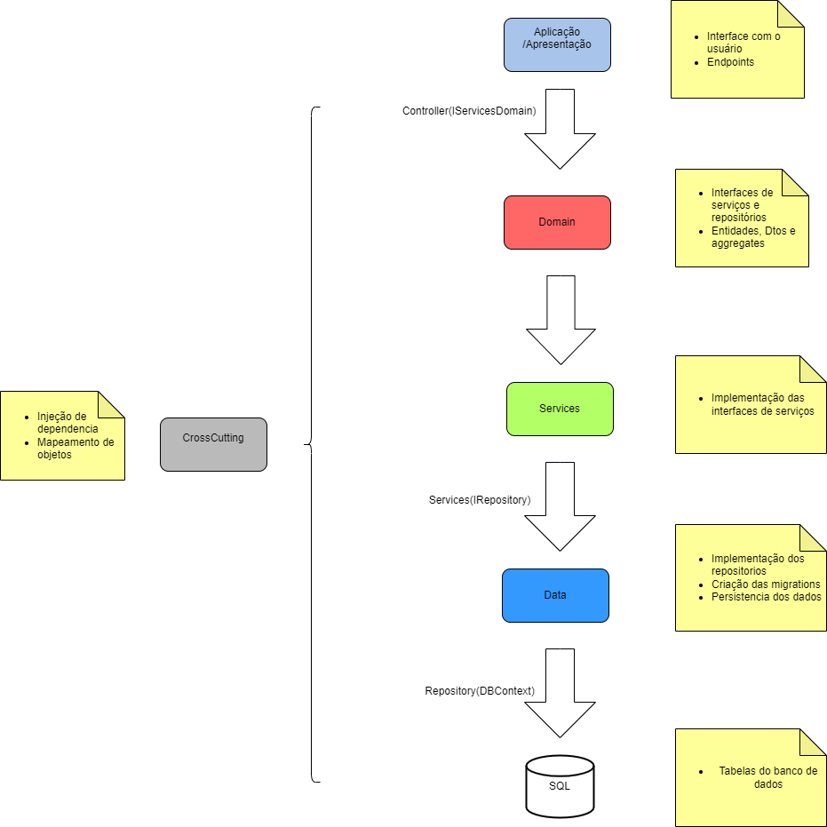

# APIs e Web Services

O planejamento de uma aplicação de APIS Web é uma etapa fundamental para o sucesso do projeto. Ao planejar adequadamente, você pode evitar muitos problemas e garantir que a sua API seja segura, escalável e eficiente.

Aqui estão algumas etapas importantes que devem ser consideradas no planejamento de uma aplicação de APIS Web.

[Inclua uma breve descrição do projeto.]

## Objetivos da API

O primeiro passo é definir os objetivos da sua API. O que você espera alcançar com ela? Você quer que ela seja usada por clientes externos ou apenas por aplicações internas? Quais são os recursos que a API deve fornecer?

[Inclua os objetivos da sua api.]


## Arquitetura

A Api é caracterizada por utilizar um design monolítico com serviços. Nesse estilo há três componentes fundamentais: interface com o usuário, serviços e um banco de dados. Os serviços são acessados por meio de uma API(Interface de Programação de aplicações), do tipo REST(Representational State Transfer). O banco de dados é único e compartilhado com todos os serviços criados. Os dados são acessados através de transações com propriedades ACID(Atomicidade,Consistência, Durabilidade e isolamento).




## Modelagem da Aplicação
[Descreva a modelagem da aplicação, incluindo a estrutura de dados, diagramas de classes ou entidades, e outras representações visuais relevantes.]


## Fluxo de Dados

O fluxo de dados da Api se deu da seguinte forma, com cada camada com sua própria responsabilidade:



## Requisitos

As tabelas que se seguem apresentam os requisitos funcionais e não funcionais que detalham o escopo do projeto. Para determinar a prioridade de requisitos, aplicar uma técnica de priorização de requisitos e detalhar como a técnica foi aplicada.

## Requisitos Funcionais

|ID    | Descrição do Requisito  | Prioridade |
|------|-----------------------------------------|----|
|RF-001| Permitir que os usuários criem contas para acessar a aplicação. | ALTA | 
|RF-002| Permitir que o usuário reserve passagens aéreas   | ALTA |
|RF-003| Permitir que os usuários busquem voos com base em critérios como origem, destino, data e preferências.   | ALTA |
|RF-004| Permitir que os usuários visualizem e editem suas reservas existentes, incluindo alterações de voo e cancelamentos.   | ALTA |
|RF-005| Mostrar informações detalhadas sobre os voos disponíveis, incluindo horários, companhias aéreas, preços e escalas.   | ALTA |
|RF-006| Enviar notificações de confirmação de reserva para os usuários após a conclusão bem-sucedida da reserva.   | MÉDIA |
|RF-007| Enviar notificações de lembretes de viagens marcardas.   | MÉDIA |

## Requisitos Não Funcionais

|ID     | Descrição do Requisito  |Prioridade |
|-------|-------------------------|----|
|RNF-001| Garantir tempos de resposta rápidos durante a busca de voos e processo de reserva, mesmo em horários de pico, garantindo desempenho. | ALTA | 
|RNF-002| Proteger os dados pessoais e financeiros dos usuários com medidas de segurança robustas, como criptografita assegurando confidenciabilidade e integridade  |  ALTA | 
|RNF-003|  Projetar o sistema para lidar com um grande volume de usuários simultâneos, especialmente durante períodos de alta demanda gatantindo escalabilidade |  ALTA | 
|RNF-004| Projetar o sistema com código limpo e modular para facilitar a manutenção e futuras atualizações para melhor manutenibilidade |  MÉDIA | 
|RNF-005| Assegurar alta disponibilidade do sistema, minimizando tempo de inatividade não planejado, reforçando sua confiabilidadde |  MÉDIA |

## Tecnologias Utilizadas

Foi desenvolvida uma api REST utilizando a linguagem C# e o framework Asp.net core. Para armazenamento foi utilizado o banco de dados relacional MySql. Para push notification foi utilizado o Firebase. Por fim, para hospedar a api foi escolhido a plataforma de nuvem Azure através do seu serviços de aplicativos. Lista das tecnologias:

| Tecnologia | Aplicação |
|---|---|
| C# | Implementação do Backend |
| Asp.net core | Framework |
| MySql | Banco de Dados |
| Firebase | Implementação do Push notification |
| Azure | Deploy da web api |


## API Endpoints

[Liste os principais endpoints da API, incluindo as operações disponíveis, os parâmetros esperados e as respostas retornadas.]

### Endpoint 1
- Método: GET
- URL: /endpoint1
- Parâmetros:
  - param1: [descrição]
- Resposta:
  - Sucesso (200 OK)
    ```
    {
      "message": "Success",
      "data": {
        ...
      }
    }
    ```
  - Erro (4XX, 5XX)
    ```
    {
      "message": "Error",
      "error": {
        ...
      }
    }
    ```


## Considerações de Segurança

[Discuta as considerações de segurança relevantes para a aplicação distribuída, como autenticação, autorização, proteção contra ataques, etc.]

## Implantação

[Instruções para implantar a aplicação distribuída em um ambiente de produção.]

1. Defina os requisitos de hardware e software necessários para implantar a aplicação em um ambiente de produção.
2. Escolha uma plataforma de hospedagem adequada, como um provedor de nuvem ou um servidor dedicado.
3. Configure o ambiente de implantação, incluindo a instalação de dependências e configuração de variáveis de ambiente.
4. Faça o deploy da aplicação no ambiente escolhido, seguindo as instruções específicas da plataforma de hospedagem.
5. Realize testes para garantir que a aplicação esteja funcionando corretamente no ambiente de produção.

## Testes

[Descreva a estratégia de teste, incluindo os tipos de teste a serem realizados (unitários, integração, carga, etc.) e as ferramentas a serem utilizadas.]

1. Crie casos de teste para cobrir todos os requisitos funcionais e não funcionais da aplicação.
2. Implemente testes unitários para testar unidades individuais de código, como funções e classes.
3. Realize testes de integração para verificar a interação correta entre os componentes da aplicação.
4. Execute testes de carga para avaliar o desempenho da aplicação sob carga significativa.
5. Utilize ferramentas de teste adequadas, como frameworks de teste e ferramentas de automação de teste, para agilizar o processo de teste.

# Referências

As seguintes referências foram utilizadas para elaboração da Api:
.https://medium.com/beelabacademy/domain-driven-design-vs-arquitetura-em-camadas-d01455698ec5
.https://medium.com/beelabacademy/implementando-na-pr%C3%A1tica-rest-api-com-conceitos-de-ddd-net-core-sql-no-docker-ioc-2cb3a2e7c649
.https://medium.com/beelabacademy/implementando-na-pr%C3%A1tica-rest-api-com-conceitos-de-ddd-net-2160291a44b7
