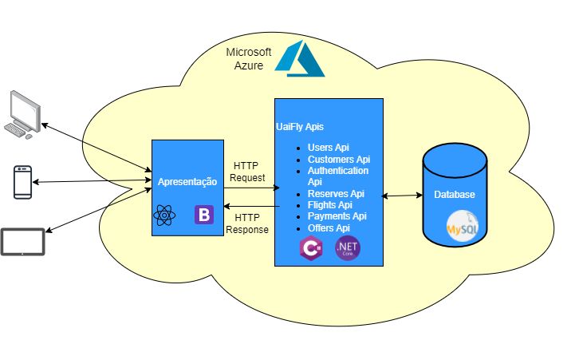

# APIs e Web Services

A Uaifly está desenvolvendo uma aplicação web para reservas de passagens aéreas, visando atender um público variado. Para garantir uma experiência robusta, a empresa adota uma arquitetura com ampla utilização de APIs e Web Services. Esses recursos são cruciais para integrar sistemas, realizar operações como pesquisa e reserva de voos, e garantir uma interação eficiente entre os módulos da aplicação. Com essa abordagem, a Uaifly busca oferecer uma plataforma escalável, segura e altamente integrada para seus clientes, independentemente de suas necessidades de viagem.

## Objetivos da API

#### Customers API: 
<strong> Objetivo: </strong> Fornecer funcionalidades para manipulação do cadastro de clientes. <br>
Destinada tanto para uso interno da empresa quanto para clientes externos, como aplicativos de parceiros ou sistemas de terceiros. <br>
<strong> Recursos Esperados: </strong> <br>
* Exclusão de clientes: Permitir a exclusão de registros de clientes do sistema. <br>
* Inclusão de clientes: Possibilitar a inclusão de novos clientes no banco de dados. <br>
* Atualização de cadastros: Permitir a atualização de informações dos clientes, como endereço, telefone, e-mail, etc.

#### Login API:
<strong> Objetivo: </strong> Realizar o processo de autenticação e autorização de usuários. <br>
Destinada a todos os usuários do sistema, sejam clientes externos ou internos da empresa. <br>
<strong> Recursos Esperados: </strong> 
* Autenticação de usuários: Verificar as credenciais de login (usuário/senha) e gerar um token de acesso válido. <br>
* Autorização de acesso: Controlar o acesso a recursos específicos com base nas permissões do usuário.

#### Users API: 
<strong> Objetivo: </strong> Gerenciar o cadastro e as informações dos usuários do sistema. <br>
Destinada a usuários internos da empresa, como administradores e equipes de suporte. <br>
<strong> Recursos Esperados: </strong> 
* Cadastro de usuários: Permitir a criação de novos usuários no sistema, especificando seus dados básicos, funções e permissões. <br>
* Gerenciamento de usuários: Oferecer funcionalidades para atualização, exclusão e listagem de usuários cadastrados.

## Arquitetura

A Api é caracterizada por utilizar um design monolítico com serviços. Nesse estilo há três componentes fundamentais: interface com o usuário, serviços e um banco de dados. Os serviços são acessados por meio de uma API(Interface de Programação de aplicações), do tipo REST(Representational State Transfer). O banco de dados é único e compartilhado com todos os serviços criados. Os dados são acessados através de transações com propriedades ACID(Atomicidade,Consistência, Durabilidade e isolamento).




## Modelagem da Aplicação


## Fluxo de Dados

O fluxo de dados da Api se deu da seguinte forma, com cada camada com sua própria responsabilidade:


## Requisitos

As tabelas que se seguem apresentam os requisitos funcionais e não funcionais que detalham o escopo do projeto. Para determinar a prioridade de requisitos, aplicar uma técnica de priorização de requisitos e detalhar como a técnica foi aplicada.

## Requisitos Funcionais

|ID    | Descrição do Requisito  | Prioridade |
|------|-----------------------------------------|----|
|RF-001| Permitir que os usuários criem contas para acessar a aplicação. | ALTA | 
|RF-002| Permitir que o usuário reserve passagens aéreas   | ALTA |
|RF-003| Permitir que os usuários busquem voos com base em critérios como origem, destino, data e preferências.   | ALTA |
|RF-004| Permitir que os usuários visualizem e editem suas reservas existentes, incluindo alterações de voo e cancelamentos.   | ALTA |
|RF-005| Mostrar informações detalhadas sobre os voos disponíveis, incluindo horários, companhias aéreas, preços e escalas.   | ALTA |
|RF-006| Enviar notificações de confirmação de reserva para os usuários após a conclusão bem-sucedida da reserva.   | MÉDIA |
|RF-007| Enviar notificações de lembretes de viagens marcardas.   | MÉDIA |

## Requisitos Não Funcionais

|ID     | Descrição do Requisito  |Prioridade |
|-------|-------------------------|----|
|RNF-001| Garantir tempos de resposta rápidos durante a busca de voos e processo de reserva, mesmo em horários de pico, garantindo desempenho. | ALTA | 
|RNF-002| Proteger os dados pessoais e financeiros dos usuários com medidas de segurança robustas, como criptografita assegurando confidenciabilidade e integridade  |  ALTA | 
|RNF-003|  Projetar o sistema para lidar com um grande volume de usuários simultâneos, especialmente durante períodos de alta demanda gatantindo escalabilidade |  ALTA | 
|RNF-004| Projetar o sistema com código limpo e modular para facilitar a manutenção e futuras atualizações para melhor manutenibilidade |  MÉDIA | 
|RNF-005| Assegurar alta disponibilidade do sistema, minimizando tempo de inatividade não planejado, reforçando sua confiabilidadde |  MÉDIA |

## Tecnologias Utilizadas

Foi desenvolvida uma api REST utilizando a linguagem C# e o framework Asp.net core. Para armazenamento foi utilizado o banco de dados relacional MySql. Para push notification foi utilizado o Firebase. Por fim, para hospedar a api foi escolhido a plataforma de nuvem Azure através do seu serviços de aplicativos. Lista das tecnologias:

| Tecnologia | Aplicação |
|---|---|
| C# | Implementação do Backend |
| Asp.net core | Framework |
| MySql | Banco de Dados |
| Firebase | Implementação do Push notification |
| Azure | Deploy da web api |


## API Endpoints

[Liste os principais endpoints da API, incluindo as operações disponíveis, os parâmetros esperados e as respostas retornadas.]

### Endpoint 1
- Método: GET
- URL: /endpoint1
- Parâmetros:
  - param1: [descrição]
- Resposta:
  - Sucesso (200 OK)
    ```
    {
      "message": "Success",
      "data": {
        ...
      }
    }
    ```
  - Erro (4XX, 5XX)
    ```
    {
      "message": "Error",
      "error": {
        ...
      }
    }
    ```


## Considerações de Segurança

Para garantir os requisitos de confidenciabilidade e integridade da api, foi utilizado o JWT, que é um token criptografado de autenticação, com declarações sobre um usuário e uma chave, além dos recursos de autorização do framework asp.net core para restringir o acesso a determinadas funcionalidades da api e recursos anti-fraude.


Para abranger todos os requisitos, tanto funcionais quanto não funcionais, foram conduzidos testes manuais utilizando a ferramenta Postman, seguindo os cenários de teste definidos no Qase. Estes cenários foram redigidos conforme o formato do Gherkin, garantindo uma abordagem estruturada e compreensível.

Os testes mapeados no Qase abrangem diferentes tipos, incluindo testes funcionais para validação das funcionalidades e testes de integração para verificar a interação entre os componentes do sistema. Essa abordagem abrangente visa assegurar a qualidade e a robustez do software em todos os aspectos importantes.


Print de tela da ferramenta Qase com mapeamento dos casos de testes:

[CA-2024-04-23.pdf](https://github.com/ICEI-PUC-Minas-PMV-SI/pmv-si-2024-1-pe6-t1-g4-companhia-aerea/files/15082485/CA-2024-04-23.pdf) <br>
PDF com todos os testes realizados

# Referências

As seguintes referências foram utilizadas para elaboração da Api:
.https://medium.com/beelabacademy/domain-driven-design-vs-arquitetura-em-camadas-d01455698ec5
.https://medium.com/beelabacademy/implementando-na-pr%C3%A1tica-rest-api-com-conceitos-de-ddd-net-core-sql-no-docker-ioc-2cb3a2e7c649
.https://medium.com/beelabacademy/implementando-na-pr%C3%A1tica-rest-api-com-conceitos-de-ddd-net-2160291a44b7
