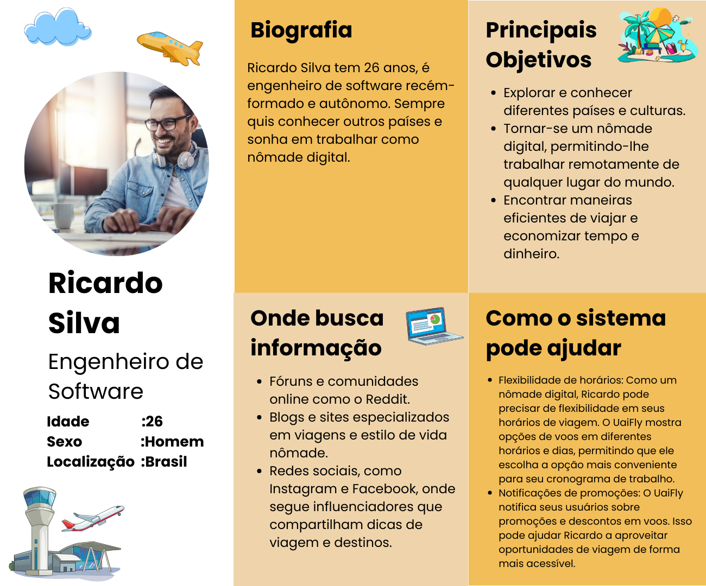
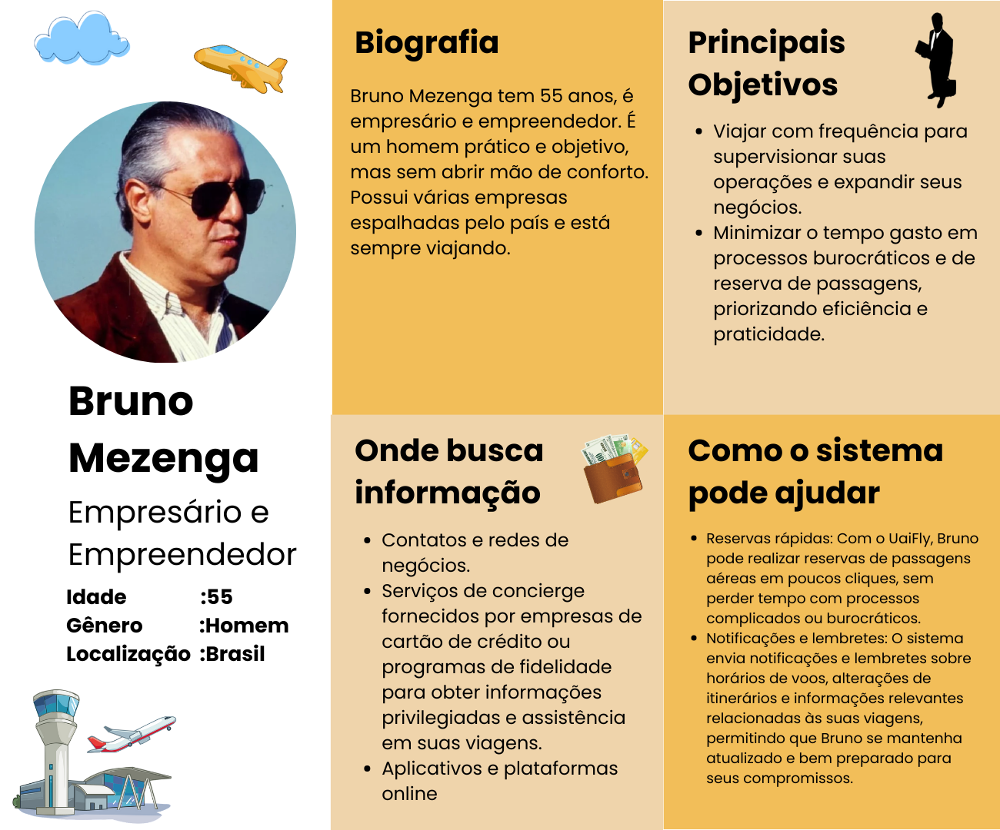

# Introdução

Texto descritivo com a visão geral do projeto abordado. Inclui o contexto, o problema, os objetivos, a justificativa e o público-alvo do projeto.

## Problema
Nesse momento você deve apresentar o problema que a sua aplicação deve  resolver. No entanto, não é a hora de comentar sobre a aplicação.

Descreva também o contexto em que essa aplicação será usada, se  houver: empresa, tecnologias, etc. Novamente, descreva apenas o que de  fato existir, pois ainda não é a hora de apresentar requisitos  detalhados ou projetos.

Nesse momento, o grupo pode optar por fazer uso  de ferramentas como Design Thinking, que permite um olhar de ponta a ponta para o problema.

> **Links Úteis**:
> - [Objetivos, Problema de pesquisa e Justificativa](https://medium.com/@versioparole/objetivos-problema-de-pesquisa-e-justificativa-c98c8233b9c3)
> - [Matriz Certezas, Suposições e Dúvidas](https://medium.com/educa%C3%A7%C3%A3o-fora-da-caixa/matriz-certezas-suposi%C3%A7%C3%B5es-e-d%C3%BAvidas-fa2263633655)
> - [Brainstorming](https://www.euax.com.br/2018/09/brainstorming/)

## Objetivos

Aqui você deve descrever os objetivos do trabalho indicando que o objetivo geral é desenvolver um software para solucionar o problema apresentado acima. 

Apresente também alguns (pelo menos 2) objetivos específicos dependendo de onde você vai querer concentrar a sua prática investigativa, ou como você vai aprofundar no seu trabalho.
 
> **Links Úteis**:
> - [Objetivo geral e objetivo específico: como fazer e quais verbos utilizar](https://blog.mettzer.com/diferenca-entre-objetivo-geral-e-objetivo-especifico/)

## Justificativa

Descreva a importância ou a motivação para trabalhar com esta aplicação que você escolheu. Indique as razões pelas quais você escolheu seus objetivos específicos ou as razões para aprofundar em certos aspectos do software.

O grupo de trabalho pode fazer uso de questionários, entrevistas e dados estatísticos, que podem ser apresentados, com o objetivo de esclarecer detalhes do problema que será abordado pelo grupo.

> **Links Úteis**:
> - [Como montar a justificativa](https://guiadamonografia.com.br/como-montar-justificativa-do-tcc/)

## Público-Alvo

Descreva quem serão as pessoas que usarão a sua aplicação indicando os diferentes perfis. O objetivo aqui não é definir quem serão os clientes ou quais serão os papéis dos usuários na aplicação. A ideia é, dentro do possível, conhecer um pouco mais sobre o perfil dos usuários: conhecimentos prévios, relação com a tecnologia, relações
hierárquicas, etc.

Adicione informações sobre o público-alvo por meio de uma descrição textual, diagramas de personas e mapa de stakeholders.

> **Links Úteis**:
> - [Público-alvo](https://blog.hotmart.com/pt-br/publico-alvo/)
> - [Como definir o público alvo](https://exame.com/pme/5-dicas-essenciais-para-definir-o-publico-alvo-do-seu-negocio/)
> - [Público-alvo: o que é, tipos, como definir seu público e exemplos](https://klickpages.com.br/blog/publico-alvo-o-que-e/)
> - [Qual a diferença entre público-alvo e persona?](https://rockcontent.com/blog/diferenca-publico-alvo-e-persona/)

# Especificações do Projeto

## Personas

A fim de compreender melhor o perfil dos clientes ideais que nosso sistema almeja, foi elaborado o buyer persona de cada um das categorias encontradas no público-alvo, como podemos observar nas imagens abaixo.

## Histórias de Usuários

Com base na análise das personas forma identificadas as seguintes histórias de usuários:

|EU COMO... `PERSONA`| QUERO/PRECISO ... `FUNCIONALIDADE` |PARA ... `MOTIVO/VALOR`                 |
|--------------------|------------------------------------|----------------------------------------|
|Ricardo Silva       | Reservar passagens nos mais diversos lugares  | Para viajar a trabalho como nomade digital                           |
|Bruno Mezenga       | Reservar passagens rapidamente                | Para não perder tempo com burocracia                                 |
|José Antônio        | Comprar passagens baratas                     | Poder ver minha família durante as férias da faculdade               |
|Maria Pereira       | Reservar passagens com segurança              | Viajar com meus filhos pequenos e ficar tranquila com sua segurança  |

## Requisitos

As tabelas que se seguem apresentam os requisitos funcionais e não funcionais que detalham o escopo do projeto. Para determinar a prioridade de requisitos, aplicar uma técnica de priorização de requisitos e detalhar como a técnica foi aplicada.

### Requisitos Funcionais

|ID    | Descrição do Requisito  | Prioridade |
|------|-----------------------------------------|----|
|RF-001| Permitir que os usuários criem contas para acessar a aplicação. | ALTA | 
|RF-002| Permitir que o usuário reserve passagens aéreas   | ALTA |
|RF-003| Permitir que os usuários busquem voos com base em critérios como origem, destino, data e preferências.   | ALTA |
|RF-004| Permitir que os usuários visualizem e editem suas reservas existentes, incluindo alterações de voo e cancelamentos.   | ALTA |
|RF-005| Mostrar informações detalhadas sobre os voos disponíveis, incluindo horários, companhias aéreas, preços e escalas.   | ALTA |
|RF-006| Enviar notificações de confirmação de reserva para os usuários após a conclusão bem-sucedida da reserva.   | MÉDIA |
|RF-007| Enviar notificações de lembretes de viagens marcardas.   | MÉDIA |

### Requisitos não Funcionais

|ID     | Descrição do Requisito  |Prioridade |
|-------|-------------------------|----|
|RNF-001| Garantir tempos de resposta rápidos durante a busca de voos e processo de reserva, mesmo em horários de pico, garantindo desempenho. | ALTA | 
|RNF-002| Proteger os dados pessoais e financeiros dos usuários com medidas de segurança robustas, como criptografita assegurando confidenciabilidade e integridade  |  ALTA | 
|RNF-003| Criar uma interface intuitiva e fácil de usar, com design responsivo para suportar diferentes dispositivos e tamanhos de tela facilitando usabilidade. |  ALTA | 
|RNF-004| Suportar múltiplos idiomas e moedas para atender a uma base diversificada de usuários |  MÉDIA | 
|RNF-005|Integrar-se com Apis de terceiros como flightradar, AviationStack e outras |  MÉDIA | 

## Restrições

O projeto está restrito pelos itens apresentados na tabela a seguir.

|ID| Restrição                                             |
|--|-------------------------------------------------------|
|01| O projeto deverá ser entregue até o final do semestre |
|02| O projeto deve integra apis próprias e de terceiros   |
|03| Deve ser desenvolvido uma aplicação web               |
|04| Deve ser desenvolvida uma aplicação mobile            |
|05| Deve-se fazer o deploy na nuvem           |

# Catálogo de Serviços

Descreva aqui todos os serviços que serão disponibilizados pelo seu projeto, detalhando suas características e funcionalidades.

# Gerenciamento de Projeto

De acordo com o PMBoK v6 as dez áreas que constituem os pilares para gerenciar projetos, e que caracterizam a multidisciplinaridade envolvida, são: Integração, Escopo, Cronograma (Tempo), Custos, Qualidade, Recursos, Comunicações, Riscos, Aquisições, Partes Interessadas. Para desenvolver projetos um profissional deve se preocupar em gerenciar todas essas dez áreas. Elas se complementam e se relacionam, de tal forma que não se deve apenas examinar uma área de forma estanque. É preciso considerar, por exemplo, que as áreas de Escopo, Cronograma e Custos estão muito relacionadas. Assim, se eu amplio o escopo de um projeto eu posso afetar seu cronograma e seus custos.

## Gerenciamento de Tempo

Com diagramas bem organizados que permitem gerenciar o tempo nos projetos, o gerente de projetos agenda e coordena tarefas dentro de um projeto para estimar o tempo necessário de conclusão.

O gráfico de Gantt ou diagrama de Gantt também é uma ferramenta visual utilizada para controlar e gerenciar o cronograma de atividades de um projeto. Com ele, é possível listar tudo que precisa ser feito para colocar o projeto em prática, dividir em atividades e estimar o tempo necessário para executá-las.

## Gerenciamento de Equipe

O gerenciamento adequado de tarefas contribuirá para que o projeto alcance altos níveis de produtividade. Por isso, é fundamental que ocorra a gestão de tarefas e de pessoas, de modo que os times envolvidos no projeto possam ser facilmente gerenciados. 

# Arquitetura da Solução

Definição de como o software é estruturado em termos dos componentes que fazem parte da solução e do ambiente de hospedagem da aplicação.

## Tecnologias Utilizadas

Descreva aqui qual(is) tecnologias você vai usar para resolver o seu problema, ou seja, implementar a sua solução. Liste todas as tecnologias envolvidas, linguagens a serem utilizadas, serviços web, frameworks, bibliotecas, IDEs de desenvolvimento, e ferramentas.

Apresente também uma figura explicando como as tecnologias estão relacionadas ou como uma interação do usuário com o sistema vai ser conduzida, por onde ela passa até retornar uma resposta ao usuário.

## Hospedagem

Explique como a hospedagem e o lançamento da plataforma foi feita.

> **Links Úteis**:
>
> - [Website com GitHub Pages](https://pages.github.com/)
> - [Programação colaborativa com Repl.it](https://repl.it/)
> - [Getting Started with Heroku](https://devcenter.heroku.com/start)
> - [Publicando Seu Site No Heroku](http://pythonclub.com.br/publicando-seu-hello-world-no-heroku.html)
