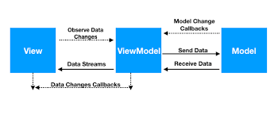
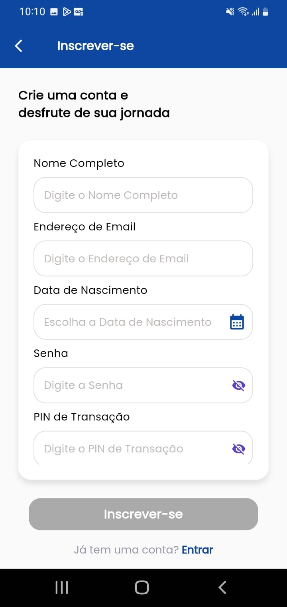
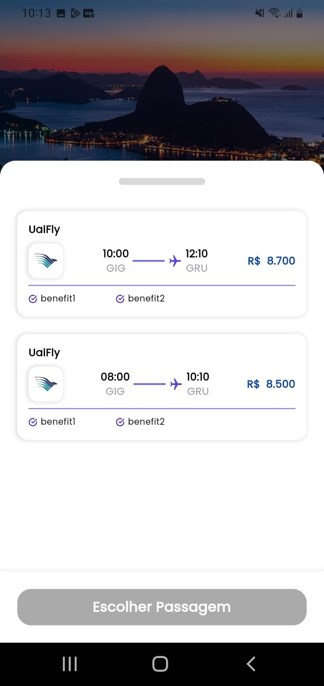

# Front-end Móvel

A aplicação do sistema de reserva de voos da UaiFly visa proporcionar aos usuários uma experiência fácil e intuitiva para buscar, reservar e gerenciar voos. A aplicação foi feita utilizando flutter. Os objetivos principais do projeto são:

- Facilitar a busca por voos com base em diferentes critérios (data, destino, preço, etc.).
- Permitir a reserva de voos de maneira rápida e segura.
- Fornecer informações detalhadas sobre voos e reservas.
- Oferecer uma interface amigável e acessível em diversos dispositivos móveis.

## Tecnologias Utilizadas

- **Flutter**: Framework principal para desenvolvimento da aplicação mobile.
- **Dart**: Linguagem de programação utilizada no Flutter.
- **Firebase**: Para autenticação, banco de dados em tempo real e armazenamento.
- **REST API**: Para comunicação com os serviços de backend.
- **Provider**: Para gerenciamento de estado.
- **SQLite**: Para armazenamento de dados locais.
- **Git**: Para controle de versão.
- **CI/CD**: Para integração contínua e deploy contínuo.

## Arquitetura

A arquitetura da aplicação é baseada no padrão MVVM (Model-View-ViewModel), que promove a separação de responsabilidades e facilita a manutenção e escalabilidade do código.

- **Model**: Representa os dados e a lógica de negócio da aplicação.
- **View**: Componente responsável pela interface do usuário e exibição dos dados.
- **ViewModel**: Intermediário entre Model e View, gerencia os dados apresentados pela View e lida com a lógica de apresentação.

Arquitetura de uma aplicação que usa MVVM

## Modelagem da Aplicação

## Projeto da Interface

O projeto da interface móvel focará em proporcionar uma experiência visualmente agradável e funcional:

- **Design Visual**: Utilização de uma paleta de cores clara e moderna, tipografia legível e ícones intuitivos.
- **Layout das Páginas**: Estrutura clara com navegação simples entre as páginas principais (Busca de Voos, Detalhes do Voo, Reserva, Perfil do Usuário).
- **Interações do Usuário**: Animações suaves e transições fluidas entre telas.

### Wireframes

Os wireframes das páginas principais mostrarão a disposição dos elementos:

- **Tela de Login**: Tela inicial onde o usuário faz login ou se registra.
- **Tela de Voos disponíveis**: Lista de voos disponíveis.
- **Tela de Detalhes do Voo**: Informações detalhadas sobre o voo selecionado.
- **Tela de Reservas**: Reservas ativas e concluídas.
- **Tela de configurações**: Configurações do perfil do usuário

 
<strong>primeira tela</strong>  
 
<strong>tela de login</strong>  
 
<strong>tela de registro</strong>  
 
<strong>tela inicial</strong>  
 
<strong>tela de pesquisa de voos</strong>  
 
<strong>tela de voos disponíveis</strong>  
 
<strong>tela de detalhes do voo escolhido</strong>  
 
<strong>tela de reservas</strong>  
 
<strong>tela de detalhes do voo</strong> 
 
<strong>tela de configuraçoes</strong> 

### Design Visual

- **Paleta de Cores**: Azul para elementos de destaque, branco para fundo, cinza para texto secundário. Modo escuro disponível para conforto visual.
- **Tipografia**: Fonte roboto clara e moderna.
- **Ícones**: Ícones minimalistas e intuitivos para ações principais, seguindo o padrão por todas as telas.

### Layout Responsivo

A interface será adaptada para diferentes tamanhos de tela e dispositivos, garantindo uma experiência consistente em smartphones e tablets:

- **Grid Flexível**: Utilização de flexbox para adaptar os layouts.
- **Elementos Escaláveis**: Imagens e botões redimensionáveis conforme a tela

### Interações do Usuário

As interações incluirão:

- **Animações**: Animações suaves ao carregar dados e mudar de página.
- **Transições**: Transições fluidas entre telas para uma navegação agradável.
- **Feedback Visual**: Indicações visuais de ações realizadas, como cliques e carregamento e modais para confirmações.

## Fluxo de Dados

- **Autenticação**: O usuário interage com a aplicação para realizar login ou registro, a aplicação se comunica com o Firebase Authentication para validar o usuário.
- **Busca de Voos**: O usuário insere critérios de busca, a aplicação se comunica com a API de voos que consulta o banco de dados e retorna os resultados.
- **Detalhes e Reserva**: O usuário seleciona um voo, visualiza os detalhes e pode realizar uma reserva. A aplicação envia a requisição de reserva para a API, que atualiza o banco de dados e confirma a reserva.
- **Gestão de Reservas**: O usuário pode ver suas reservas ativas e histórico, a aplicação solicita esses dados da API, que consulta o banco de dados e retorna as informações.
- **Notificações**: O backend monitora eventos importantes e utiliza o Firebase Cloud Messaging para enviar notificações push para os dispositivos dos usuários.

## Requisitos Funcionais

- Busca de voos com base em critérios.
- Visualização de detalhes dos voos.
- Realização de reservas.
- Gestão de Reservas Ativas 
- Histórico de Reservas 
- Autenticação de usuários.
- Gerenciamento de perfil do usuário.
- Notificações de Atualizações e Promoções 

## Requisitos Não Funcionais

- **Desempenho**: Resposta rápida às interações do usuário.
- **Segurança**: Proteção dos dados do usuário.
- **Escalabilidade**: Suporte a um grande número de usuários.
- **Usabilidade**: Interface intuitiva e fácil de usar.

## Considerações de Segurança

- **Autenticação e Autorização**: Uso do Firebase Authentication para autenticação segura.
- **Proteção contra Ataques**: Implementação de medidas contra ataques comuns, como SQL Injection e Cross-Site Scripting.
- **Criptografia**: Dados sensíveis como senhas criptografados em trânsito e em repouso

### **Implantação**

- **Requisitos de Hardware e Software**:
  - Servidor de aplicação (Firebase ou similar)
  - Banco de dados (Firebase Firestore ou similar)
  - Configuração de CI/CD para deploy contínuo
- **Plataforma de Hospedagem**:
  - Firebase Hosting para front-end
  - Google Cloud ou AWS para backend e banco de dados
- **Configuração do Ambiente de Implantação**:
  - Instalação de dependências via flutter pub get
  - Configuração de variáveis de ambiente no Firebase
- **Deploy da Aplicação**:
  - Seguir instruções do Firebase CLI para deploy
  - Testes pós-deploy para garantir o funcionamento correto

### **Testes**

- **Estratégia de Teste**:
  - Testes Unitários
  - Testes de Integração
  - Testes de Carga
- **Casos de Teste**:
  - Cobertura de todos os requisitos funcionais e não funcionais
- **Implementação de Testes**:
  - Utilização do pacote flutter_test para testes unitários
  - Testes de integração com Firebase Emulator Suite
  - Testes de carga utilizando ferramentas como Apache JMeter
- **Ferramentas de Teste**:
  - Flutter Test
  - Firebase Test Lab
  - JMeter

# Referências

https://kauemurakami.medium.com/um-pouco-sobre-o-getx-pattern-efb191187d7