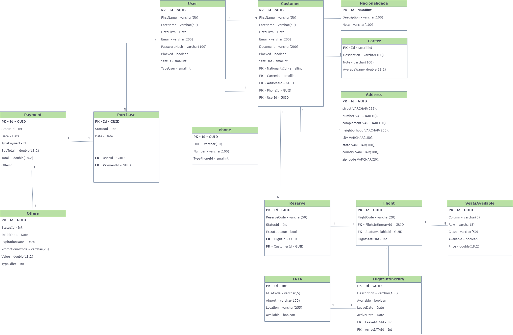

# Front-end Web

Nesta fase do projeto da Uaifly, foi estabelecido a arquitetura com APIs e Web Services, iniciando o desenvolvimento do front-end usando React, react-router e Material-UI. Isso permite criar uma interface de usuário intuitiva e atraente, alinhada aos requisitos já estabelecidos, proporcionando uma experiência de reserva de passagens aéreas fluida e confiável, mantendo a integração com o back-end já implementado.

## Tecnologias Utilizadas
<strong> - React: </strong>
Framework JavaScript para a construção da interface de usuário.

<strong> - React-Router: </strong>
Biblioteca para gerenciamento de rotas e navegação em aplicativos React.

<strong> - Material-UI: </strong>
Biblioteca de componentes React que implementa as diretrizes de design do Material Design, fornecendo componentes pré-projetados para uma interface de usuário consistente e atraente.

<strong> - Vite: </strong>
Construtor de aplicações JavaScript rápido e leve que utiliza ESM (ECMAScript Modules) para um desenvolvimento mais eficiente.

## Arquitetura

A arquitetura da aplicação web da UaiFly é cuidadosamente projetada para proporcionar uma experiência de usuário excelente, com um frontend interativo e responsivo, um backend robusto e seguro, e uma integração eficiente entre todos os componentes. A utilização de ferramentas modernas para design e desenvolvimento garante que a aplicação seja escalável, acessível e fácil de manter.

## Modelagem da Aplicação

## Projeto da Interface Web
A interface web da aplicação da Uaifly foi projetada seguindo as diretrizes do Material Design, com uma paleta de cores vibrantes e uma tipografia legível. O layout é organizado para facilitar a navegação, com interações responsivas e animações sutis para indicar transições entre páginas. As opções de viagem são apresentadas de forma clara e interativa, considerando a acessibilidade por meio de design responsivo, suporte a leitores de tela e opções de contraste ajustável. Em resumo, a interface web oferece uma experiência completa e agradável para a reserva de passagens aéreas, atendendo às necessidades de diversos usuários.

### Wireframes
A UaiFly utilizou a ferramenta Miro para idealizar o modelo da página, distribuindo os componentes de forma harmoniosa. O uso do Miro permitiu a criação de um wireframe simples, fornecendo uma noção clara dos espaços e da disposição geral dos elementos. Esse wireframe básico ajudou a esboçar a estrutura principal da página, incluindo a localização de botões, menus, imagens e textos, garantindo uma navegação intuitiva. A ferramenta também facilitou a colaboração entre os membros da equipe, permitindo ajustes rápidos e feedback imediato, essencial para otimizar a experiência do usuário desde as fases iniciais do design. 
 
 

### Design Visual
A UaiFly aplica o conceito de material como metáfora para criar interfaces intuitivas que simulam objetos reais. Isso significa que botões, cartões e outros elementos da interface possuem sombras e profundidades, oferecendo uma sensação de realismo e tangibilidade. Ao usar essas características, a navegação no site e no aplicativo da UaiFly torna-se mais natural e envolvente.

A UaiFly utiliza cores vibrantes e a tipografia Roboto para destacar informações importantes de forma clara. As cores claras melhoram a estética e a legibilidade. Animações sutis e transições fluidas fornecem feedback e continuidade visual, melhorando a experiência do usuário. O layout responsivo permite acesso fácil em qualquer dispositivo, essencial para viajantes em movimento. A UaiFly adota componentes de interface do Material Design, como botões e cartões, que são esteticamente agradáveis e funcionais, contribuindo para uma experiência coesa e eficiente.

Ao adotar os princípios do Material Design, a UaiFly oferece uma interface de usuário que é ao mesmo tempo moderna e intuitiva. Essa abordagem não só melhora a estética do site e do aplicativo, mas também facilita a navegação e o acesso às informações, proporcionando uma experiência de usuário superior. Com a UaiFly, voar se torna não apenas uma viagem, mas uma experiência digital agradável e eficiente.

#### Logo Tipo
Foi criada uma logomarca para a Uaifly que incorpora o nome da empresa e um design visualmente atraente. A logo utiliza as cores predominantes do site, garantindo uma identidade visual coesa. Além disso, um ícone de avião foi estrategicamente posicionado abaixo do nome "Uaifly", criando a ilusão de um sorriso. Este detalhe não apenas evoca a ideia de viagem, mas também simboliza a felicidade e a satisfação que a marca deseja transmitir aos seus usuários ao visualizarem a logomarca.

#### Tipografia   

  
  
#### Paleta de Cores   

### Layout Responsivo
A adoção do Material UI no site da UaiFly é uma estratégia consolidada e testada no mercado para o desenvolvimento web responsivo. A combinação da estrutura adaptativa do Material UI com princípios de layout fluído e escalável garante uma experiência consistente em diversos dispositivos. A arquitetura de grade simplifica a distribuição flexível de conteúdo em diferentes resoluções de tela, enquanto as media queries permitem a personalização do estilo e comportamento dos componentes conforme a largura da tela. A modularidade dos componentes oferece uma abordagem escalável para criar layouts versáteis e adaptáveis, garantindo uma experiência de usuário satisfatória e intuitiva em todos os contextos de visualização.

### Interações do Usuário
Na interface da UaiFly, as interações do usuário são cuidadosamente projetadas para oferecer uma experiência fluida e intuitiva. Aqui estão alguns aspectos principais:  

<strong> Opção de Modo Escuro: </strong> Os usuários têm a opção de alternar entre o modo claro e o modo escuro. Esta funcionalidade não apenas melhora a experiência visual em ambientes com pouca luz, mas também ajuda a reduzir o cansaço visual durante a navegação noturna.  

#### Elementos Interativos:

<strong> 1. Botões e Ícones: </strong> Botões ganham um efeito de sombra ou cor quando clicados, e ícones interativos mostram animações de rotação ou transformação para indicar que uma ação está em andamento.  
<strong> 2. Modais e Diálogos: </strong>  Quando pop-ups ou diálogos são ativados, eles surgem com uma leve animação de zoom ou fade-in, chamando a atenção do usuário sem ser intrusivo.  
<strong> 3. Scroll Suave: </strong> Ao rolar pela página, a rolagem é suave, evitando saltos bruscos e permitindo que os usuários leiam e interajam com o conteúdo de maneira mais confortável.  

Essas interações combinadas garantem que a navegação e o uso do site ou aplicativo da UaiFly sejam agradáveis, eficientes e satisfatórios, elevando a experiência do usuário a um nível superior.  

## Fluxo de Dados

Fluxo de Dados na Aplicação

1. Estrutura Geral da Aplicação

Entrada do Usuário (Cadastro):
   - Formulários para coleta de dados do usuário (usando componentes do Material-UI).
   - Validação de dados de entrada.
   - Armazenamento temporário no LocalStorage após submissão.

Carregamento de Dados Estáticos:
   - JSON estático armazenado localmente ou embutido no código.
   - Uso desses dados para renderizar as interfaces (listas, tabelas, etc).

2. Componentes e Estado
Componentes de Cadastro:
 - Formulário de Cadastro: Campos de entrada (TextField, Select, etc.).
 - Estado Local: Uso do hook `useState` para gerenciar o estado dos campos do formulário.
 - Armazenamento Local: Armazenar os dados no LocalStorage quando o formulário é submetido.

Componentes de Exibição de Dados:
  - Componente de Lista/Tabela: Exibe dados carregados do JSON estático.
  - Estado Local: Uso do hook `useState` para gerenciar os dados carregados.

3. Fluxo de Dados

Cadastro de Usuário:
   - Input do Usuário: O usuário preenche o formulário.
   - Validação e Submissão:
     - Validação dos campos do formulário.
     - Armazenamento dos dados no LocalStorage.
   - Estado Local: Gerenciar os dados do formulário.

Carregamento de Dados Estáticos:
   - JSON Local: Carregar dados do JSON estático.
   - Uso de Estado: Uso do hook `useState` e `useEffect` para carregar e gerenciar esses dados.

Fluxo de Dados Resumido
Cadastro de Usuário:
   - O usuário interage com o formulário de cadastro.
   - Os dados do formulário são gerenciados no estado local do componente.
   - Ao submeter, os dados são validados e salvos no LocalStorage.

Exibição de Dados:
   - JSON estático é carregado quando o componente de exibição de dados é montado.
   - Os dados são armazenados no estado local e utilizados para renderizar a interface.

Considerações Finais

- Validação: Implementar validação dos campos de formulário para garantir a integridade dos dados.
- Manutenção: Separar os componentes e manter o código modular para facilitar a manutenção e a escalabilidade.
- Segurança: Embora o LocalStorage seja conveniente para armazenamento temporário, considere a segurança e a privacidade dos dados armazenados.

Esse é um fluxo de dados básico que pode ser ajustado conforme suas necessidades específicas e conforme o backend for desenvolvido.

### Requisitos Funcionais

|ID    | Descrição do Requisito  | Prioridade |
|------|-----------------------------------------|----|
|RF-001| Permitir que os usuários criem contas para acessar a aplicação. | ALTA | 
|RF-002| Permitir que o usuário reserve passagens aéreas   | ALTA |
|RF-003| Permitir que os usuários busquem voos com base em critérios como origem, destino, data e preferências.   | ALTA |
|RF-004| Permitir que os usuários visualizem e editem suas reservas existentes, incluindo alterações de voo e cancelamentos.   | ALTA |
|RF-005| Mostrar informações detalhadas sobre os voos disponíveis, incluindo horários, companhias aéreas, preços e escalas.   | ALTA |
|RF-006| Enviar notificações de confirmação de reserva para os usuários após a conclusão bem-sucedida da reserva.   | MÉDIA |
|RF-007| Enviar notificações de lembretes de viagens marcardas.   | MÉDIA |

### Requisitos não Funcionais

|ID     | Descrição do Requisito  |Prioridade |
|-------|-------------------------|----|
|RNF-001| Garantir tempos de resposta rápidos durante a busca de voos e processo de reserva, mesmo em horários de pico, garantindo desempenho. | ALTA | 
|RNF-002| Proteger os dados pessoais e financeiros dos usuários com medidas de segurança robustas, como criptografita assegurando confidenciabilidade e integridade  |  ALTA | 
|RNF-003| Criar uma interface intuitiva e fácil de usar, com design responsivo para suportar diferentes dispositivos e tamanhos de tela facilitando usabilidade. |  ALTA | 
|RNF-004| Suportar múltiplos idiomas e moedas para atender a uma base diversificada de usuários |  MÉDIA | 
|RNF-005|Integrar-se com Apis de terceiros como flightradar, AviationStack e outras |  MÉDIA | 

## Considerações de Segurança

Para garantir os requisitos de confidenciabilidade e integridade da api, foi utilizado o JWT, que é um token criptografado de autenticação, com declarações sobre um usuário e uma chave, além dos recursos de autorização do framework asp.net core para restringir o acesso a determinadas funcionalidades da api e recursos anti-fraude.

## Testes

Os testes mapeados no Qase abrangem diferentes tipos, incluindo testes funcionais para validação das funcionalidades e testes de integração para verificar a interação entre os componentes do sistema. Além disso, foram incorporados testes de usabilidade focados no frontend para garantir que a experiência do usuário seja intuitiva, eficiente e satisfatória. Essa abordagem abrangente visa assegurar a qualidade, a robustez e a usabilidade do software em todos os aspectos importantes.

Print de tela da ferramenta Qase com mapeamento dos casos de testes dessa etapa

[CA-2024-05-21.pdf](https://github.com/ICEI-PUC-Minas-PMV-SI/pmv-si-2024-1-pe6-t1-g4-companhia-aerea/files/15396066/CA-2024-05-21.pdf)  
PDF com todos os testes realizados

# Referências

### As seguintes referências foram utilizadas para elaboração da Api:
.https://medium.com/beelabacademy/domain-driven-design-vs-arquitetura-em-camadas-d01455698ec5  
.https://medium.com/beelabacademy/implementando-na-pr%C3%A1tica-rest-api-com-conceitos-de-ddd-net-core-sql-no-docker-ioc-2cb3a2e7c649  
.https://medium.com/beelabacademy/implementando-na-pr%C3%A1tica-rest-api-com-conceitos-de-ddd-net-2160291a44b7  

### As seguintes referências foram utilizadas para elaboração da Arquitetura Front-End:
https://pt-br.legacy.reactjs.org/docs/getting-started.html  
https://reactrouter.com/en/6.23.1/web/guides/quick-start

